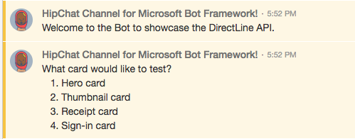
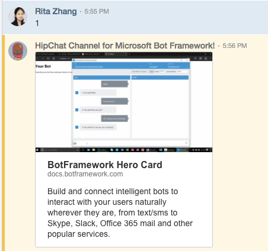

# HipChat Channel for Microsoft Bot Framework

This project serves as an example of how one can build a HipChat Connect add-on for Microsoft Bot Framework bots using [Atlassian-Connect-Express](https://developer.atlassian.com/hipchat/tutorials/getting-started-with-atlassian-connect-express-node-js) and [DirectLine](https://docs.botframework.com/en-us/restapi/directline3/).


## What

The [Microsoft Bot Framework](https://dev.botframework.com/) natively supports a set of [channels](https://docs.botframework.com/faq/#what-channels-does-the-bot-framework-currently-support) out of the box. In order to support your own channel, you'll need to use the Direct Line API to expose your bots to the channel. This HipChat Channel for the Microsoft Bot Framework is a demonstration of how to implement your own channel support.

## Installation

1. Git Clone
    ```
    $ git clone [this_git_repo]
    $ cd botframework-hipchatchannel
    ```

2. Setup ngrok to develop locally (see [this](https://developer.atlassian.com/static/connect/docs/latest/developing/developing-locally-ngrok.html) for more info).

    ```
    $ ngrok http 3000
    ```

    Update the `localBaseUrl` variable in `config.json` with the HTTPS address of your ngrok instance

3. Configure the Direct Line secret for your Microsoft Bot Framework bot

    ```
    $ export DIRECT_LINE_SECRET=[your_direct_line_secret]
    ```

    Assuming you already have a bot running using the Microsoft Bot Framework, the Direct Line Secret can be obtained through the Bot Framework developer portal in the channels list. Ensure that v3.0 is enabled.

4. Start Redis

    ```
    $ redis-server
    ```

5. Start the app

    ```
    $ npm install
    $ node app.js
    ```

## Usage

1. Deploy your bot created using the Microsoft Bot Framework
    You can use the [sample bot](bot/) included in this project. 
    
2. Get the Direct Line Secret from the Bot Framework developer portal and configure the `DIRECT_LINE_SECRET` env variable
3. From a browser, navigate to the HTTPS address of your ngrok instance

    

4. Install the connector to a room in your HipChat instance. See [this](https://confluence.atlassian.com/hc/integrations-with-hipchat-server-683508267.html#IntegrationswithHipChatServer-IntegratingHipChatBots) for further details.
5. Start chatting with the bot

    
6. Here are examples of some of the basic cards from Bot Framework:

    Hero card

    

    Thumbnail card

    

    Receipt card

    

    Signin card

    


